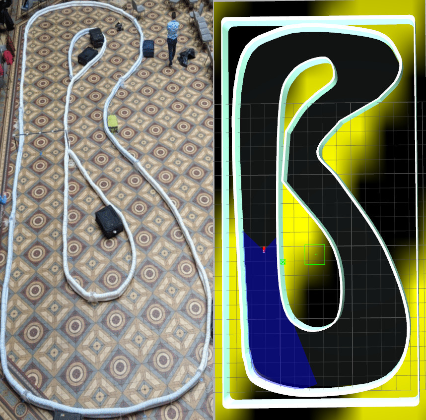

## F1 Tenth Simulator for the SAE Curriculum

This simulator has been tested for ROS Noetic. Install these dependencies BEFORE cloning and building the repository

### Additional Dependencies:

Use `sudo apt install` to install the first 5 dependencies and then follow the specific instructions provided.
* ros-noetic-ros-control*
* ros-noetic-gazebo-ros-control
* ros-noetic-ackermann-msgs
* ros-noetic-joy
* ros-noetic-pid
* **OpenCV**:
  To install OpenCV use the command `sudo apt install libopencv-dev python3-opencv`
* To install the `driver-base` package follow these instructions:
  * Move into the `src` folder of your workspace (You can install this in the `ros_ws/src` as it's a dependency & you won't be pushing this to Github).
  * Clone the repository by entering `git clone https://github.com/ros-drivers/driver_common.git`
  * Enter `catkin_make` at the root of your repository.
* **QT4**: Install Qt4 (Ubuntu 20.04 comes with Qt5 by default) by following these instructions:
  * ```
    sudo add-apt-repository ppa:gezakovacs/ppa
    sudo apt update
    sudo apt install qt4-default
    ```
While using OpenCV you may need to add this to your `.profile`

```bash
export LD_LIBRARY_PATH=/usr/local/lib /usr/local/bin/python3
```

### Instructions to Install:

Clone the package into your git workspace and symlink it into the `src` in the catkin_workspace. To clone the package run:

```
$ git clone https://github.com/SAE-Robotics-Bootcamp/f110-simulator-public.git
```

### Instructions to Launch:

To launch the simulator run the following command: 
```
$ roslaunch race f1_tenth.launch
```

After the Gazebo window has opened, you can click in the terminal from which you ran the launch command and teleoperate the car.
The commands used to teleoperate the car using the keyboard are: ``` W, A, S and D```
If it doesn't not teleoperate the 1st time you press a key, press it again. 

Press ```Ctrl + c``` twice to terminate the process in the terminal.


### Vehicle Characteristics:

| Velocity       | Full Left | Straight | Full Right |
| :------------- | --------- | -------- | ---------- |
| Steering value | -0.5      | 0        | 0.5        |

While using it to test an external controller, the control commands are to be issued on the topic:

`/vesc/ackermann_cmd_mux/input/teleop`

Speed is supposed to be published on `msg.drive.speed` and steering angle is to be published on `msg.drive.steering_angle` where `msg` is an `AckermannDriveStamped` message.

If these bounds are crossed, the steering geometry distorts to unrealistic angles, hence they have to be limited in the external controller itself.

### Credits:

This repository primarily consists of a simulator for the F1-tenth vehicle built in Gazebo by MIT and further modified by UPenn. This has been tested on Gazebo 7 and Gazebo 9 with ROS Kinetic and Melodic respectively. The simulated vehicle has a Hokuyo LIDAR with 270 degrees FOV and a ZED camera as its on-board sensors. It also has an IMU and odometry estimation obtained from the [VESC](https://electric-skateboard.builders/t/new-vesc-user-read-this-complete-walktrough-of-the-vesc/2980).



Special Note
---
This simulator was build by teams at MIT to drive a car using keyboard buttons and was modified to drive the car autonomously.
